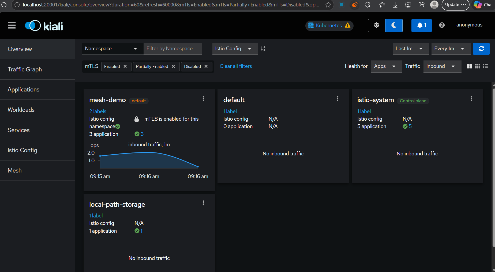
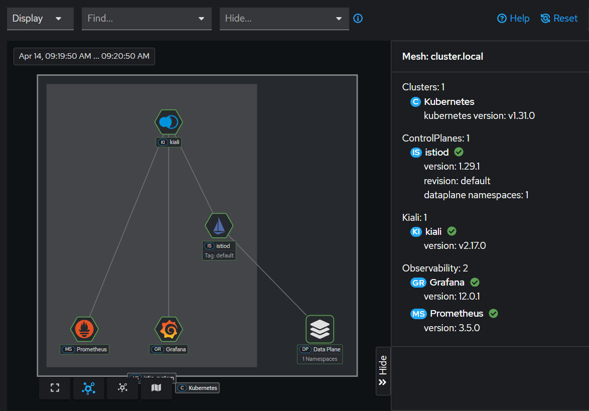

# Microservice Mesh with Istio | Service-to-Service Auth & Traffic Splitting

## Project Overview

A production-gradt **DevSecOps** implementation of a microservice mesh using **Istio** on Kubernetes, featuring zero-trust security with mTLS and canary deployment capabilities.

### Key Achivements
- **Zero-Trust Security**: Implemented strict mTLS authentication between all services
- **Canary Deployments**: 90/10 traffic splitting for risk-free rolliing updates
- **Observability** Full monitoring stack with Kiali, Prometheus & Grafana
- **Service Mesh Architecture**: 3 microservices with Envoy sidecar proxies.

### Tech Stack
- Istio 1.28
- Kubernetes
- mTLS 
- Kiali, Prometheus, Grafana
- http-echo (hashicorp)

## Prerequisites
- Kubernetes cluster
- `kubectl` configured
- `istioctl` CLI

## Quick Start
All the steps are mentioned [here](Steps.md)

## Result

